# Trace2Evals (`t2e`)

**Your production agent failures are your best test cases. This turns them into eval cases you own.**

Import agent traces from OpenTelemetry JSON or LangSmith run exports, label them fast in a
keyboard-first UI, and export versioned, framework-neutral eval cases: `cases.jsonl`, a generated
pytest suite, and optional Promptfoo config.

**No LLM calls. No telemetry. No network at runtime.** Your traces never leave your machine.

> ⚠️ **All data in this repository is synthetic.** No real traces were provided, so the fixtures in
> `fixtures/` are hand-authored to match the real wire formats, and every screen carries a synthetic-data
> banner. See [BLOCKERS.md](BLOCKERS.md) B-001.

> 📷 **No screenshot.** The build environment had no working browser
> ([BLOCKERS.md](BLOCKERS.md) B-003), so the UI is verified by component tests and live HTTP rather than
> by eye. Shipping a mocked-up screenshot would misrepresent what was checked. Run `make serve` to see it.

---

## Architecture

```mermaid
flowchart LR
    subgraph Inputs["Trace exports (files only, v1)"]
        OTEL["OpenTelemetry JSON<br/>GenAI semconv"]
        LS["LangSmith run export<br/>JSONL"]
    end

    subgraph Core["core library · pure python, no vendor SDKs"]
        P["parsers<br/>strict-but-forgiving"]
        RED["redaction<br/>regex + PII flags"]
        N["normalizer<br/>one TraceRun model"]
        P --> RED --> N
    end

    DB[("SQLite<br/>./.t2e/t2e.db")]
    API["FastAPI<br/>runs · labels · cases · export"]
    SPA["React SPA<br/>keyboard labeler"]
    CLI["t2e CLI<br/>import · label · export · stats"]

    subgraph Outputs["portable output you keep"]
        JSONL["cases.jsonl<br/>versioned + schema'd"]
        PYTEST["test_cases.py<br/>generated pytest"]
        PF["promptfooconfig.yaml<br/>optional"]
    end

    OTEL --> P
    LS --> P
    N --> DB
    DB <--> API
    API <--> SPA
    CLI <--> DB
    DB --> JSONL & PYTEST & PF

    style Outputs fill:#0B1E3B,stroke:#10B981
    style Core fill:#0B1E3B,stroke:#10B981
```



The loop: **import → label → build cases → export**. Everything is file-and-local-first; nothing
requires a running service except the local UI you launch yourself.

---

## Quickstart

```bash
# 1. install (the only step that needs network)
make install            # or: uv sync --extra dev && npm --prefix frontend install
                        # Windows without make: ./make.ps1 install

# 2. import some traces
uv run t2e import fixtures/otel fixtures/langsmith
#  -> 16 runs from 12 files; 10 record errors; 5 redactions
#  -> WARNING: payloads looked like PII (credit_card, email, iban, phone)

# 3. label them
make build                       # build the SPA once
uv run t2e label --serve         # opens http://127.0.0.1:8765

# 4. export a suite you own
uv run t2e export --version v1 --format jsonl,pytest,promptfoo --out exports

# 5. CI-friendly summary
uv run t2e stats
```

### Install as a tool

```bash
uv tool install .        # or: pipx install .
t2e --help
```

### The keyboard flow

Speed is the design goal, so the labeler is built for hands-on-keyboard:

| Key | Action |
|---|---|
| <kbd>R</kbd> <kbd>W</kbd> <kbd>P</kbd> | verdict: right / wrong / partial |
| <kbd>1</kbd>–<kbd>7</kbd> | toggle a failure tag |
| <kbd>J</kbd> <kbd>K</kbd> | move the step cursor |
| <kbd>X</kbd> | expand the step's full payload |
| <kbd>N</kbd> | focus the note field |
| <kbd>Enter</kbd> | commit and auto-advance to the next unlabeled run |
| <kbd>S</kbd> / <kbd>U</kbd> / <kbd>?</kbd> | skip / undo / help |

The failure taxonomy is closed in v1: `wrong_tool`, `bad_args`, `ungrounded`, `no_escalation`,
`format_break`, `hallucinated_fact`, `other` (+note).

### Other commands

```bash
make dev        # uvicorn --reload + vite dev server
make test       # ruff + pytest + tsc + vitest
make eval       # the evals/ suite-integrity gate
make dogfood    # re-run the labeling session end to end
make clean      # remove ./.t2e, build output, caches
```

`make.ps1` mirrors every target on Windows, where `make` may be absent ([B-002](BLOCKERS.md)).

---

## HONEST POSITIONING

**This is not a new idea, and the platforms are not standing still.**

Turning a production failure into a permanent eval case is established best practice, and the tooling
for it already exists inside the major platforms:

- **Langfuse** — annotation queues and datasets, with trace-to-dataset built in.
- **LangSmith** — add a run to a dataset from the trace view; annotation queues for human review.
- **Braintrust** — logs to datasets, with a review UI.
- **Azure AI Foundry** — its own trace-to-evaluation converter, platform-locked.

If you already live entirely inside one of those, **use theirs.** It is integrated with your traces,
your team and your billing, and it will keep improving. This tool would be a step sideways.

**The wedge is narrow and specific:**

1. **Portability.** The output is a plain JSONL file plus a pytest file. No account, no vendor schema,
   no export request. If you stop using `t2e` tomorrow, your suite still runs — `t2e.assertions` is a
   few hundred lines you can vendor outright.
2. **Cross-format.** One labeling queue over traces from *different* stacks. If half your services emit
   OTel and half run on LangChain, an in-platform tool only sees its own half.
3. **The labeling UX.** Purpose-built for one job: verdict plus tag plus advance, in three keystrokes,
   with the tool's own latency measured at under half a second per label. A general-purpose annotation
   queue is not optimised for a human grinding through fifty traces in one sitting.
4. **Local-first by default.** Zero telemetry, no network at runtime, redaction on import. If your
   traces contain customer data, "it never leaves the machine" is a feature that a SaaS cannot match.

**Where this loses:** no live trace collection (file import only), no auto-labeling, no clustering, no
hosted collaboration, no auth, no dashboards over time, and exactly two input formats. The v2 list
(Foundry importer, LLM label suggestions with human confirmation, near-duplicate failure clustering) is
where the gap narrows, and every item on it is unbuilt.

**If the platforms close the portability gap, the wedge closes with it.** That is stated in the spec's
own risk register and it is worth restating here rather than pretending otherwise.

---

## Dogfood findings

Spec 03 sec 10 requires the tool to be used on real traces before launch. **No real traces were
provided** ([B-001](BLOCKERS.md)), so the loop was run over the 12 synthetic fixtures instead, via a
committed and reproducible script: [`scripts/dogfood.py`](scripts/dogfood.py). Re-run it with
`make dogfood`.

The verdicts are considered judgements about the actual content of each trace — each carries a note
explaining the call, and they are auditable in the script and in `evals/cases.jsonl`.

### Label distribution — 16 runs

| Verdict | Runs | Share |
|---|---|---|
| right | 10 | 62% |
| partial | 4 | 25% |
| wrong | 2 | 12% |

### Failure taxonomy — 6 runs carried tags

| Tag | Count |
|---|---|
| `ungrounded` | 4 |
| `no_escalation` | 3 |
| `wrong_tool` | 1 |
| `bad_args` | 1 |
| `hallucinated_fact` | 1 |
| `format_break` | 0 |
| `other` | 0 |

**The finding that surprised me: the dominant failure was not a wrong tool call, it was an unsupported
claim.** `ungrounded` appeared in 4 of the 6 flagged runs. Three of those were *correct answers* — the
agent reached the right conclusion and then asserted it with no cited evidence, which is indefensible to
an auditor even when the answer happens to be right. That is exactly the kind of distribution a
labeling pass is supposed to surface and a summary metric would hide.

The second cluster is `no_escalation` (3 runs), including one where the upstream ledger returned a 503
and the agent correctly refused to invent an answer — but then never escalated, so the exception
silently went nowhere. Failing safe is not the same as failing usefully, and only reading the trace
shows the difference.

### The resulting suite

16 cases, 27 assertions, exported to [`evals/cases.jsonl`](evals/cases.jsonl): `must_cite` in 14 cases,
`must_call_tool` in 10, `must_escalate` in 3. The skew follows straight from the tag distribution — the
assertions are derived from the labels, so a suite is a direct reflection of what a human actually
flagged.

### On the speed claim — measured and unmeasured

The spec's target is a **<10s median per simple label**. Being precise about what is and is not verified:

- ✅ **The tool's own cost is measured**: median label round trip is **under 0.5s**, asserted in
  `tests/test_labeling_session.py`. Auto-advance rides along in the label response, so there is no
  second round trip between runs. The tool contributes well under a second of the ten.
- ✅ **The measurement path works end to end**: a label submitted with a duration produces a correct
  median in `t2e stats`, the API, and the labeler's live panel.
- ❌ **The human side is untested** ([B-004](BLOCKERS.md)). No human labeling session was ever timed —
  there was no human and no browser in the build environment. The dogfood therefore records **no**
  per-label durations rather than inventing plausible ones, and `t2e stats` honestly prints
  `no timed labels yet`.

`meets_speed_target` returns **null**, never `true`, until something is actually timed. There is a test
for that, because an unmeasured claim reporting as a passing one is the specific failure mode this whole
tool exists to prevent.

---

## Privacy

- **Local-first.** SQLite at `./.t2e/t2e.db`, in your working directory. Delete the folder and it is gone.
- **Zero telemetry.** No analytics, no crash reporting, no phone-home. The only outbound network calls
  in the whole repository are `uv sync` and `npm install`.
- **No LLM calls, by design** (spec 03 sec 8). The tool runs on a plane.
- **Redaction on import**, on by default: emails, phone numbers, SSN-shaped strings, IBANs, API keys and
  bearer tokens are replaced with `[REDACTED:<kind>]`. Card-shaped numbers are Luhn-checked first, so a
  16-digit reference number is not mangled. Redaction runs *before* normalization, so a secret cannot
  reach the UI or an export through a preview.
- **PII-lookalike warning.** Detect-only patterns (street addresses, date-of-birth labels) are flagged
  but never rewritten, and the UI and CLI both surface a banner when anything matched.
- **Fonts are system fonts.** No CDN, no external stylesheet, no remote image.

Opt out per-import with `t2e import --no-redact` — you still get the warning, and the report says
redaction was disabled.

---

## STATUS

What works, what does not, and what is unverified. Full detail in [BLOCKERS.md](BLOCKERS.md) and
[PROGRESS.md](PROGRESS.md).

**Working and tested** — 305 backend tests, 13 component tests, ruff and `tsc --strict` clean:

- Both importers, including malformed-record handling, snapshot-tested over 12 fixtures
- The normalized `TraceRun` model, with the spec's field contract asserted independently of storage
- The labeling UI: keyboard flow, auto-advance, filters, payload expanders, live session stats
- Case builder with label-derived defaults; all five assertion kinds
- All three exporters, golden-file tested — **and the generated pytest suite is proven to run**
  (12 passing with a correct adapter, failing with a broken one, refusing to run empty)
- The CLI, with CI-appropriate exit codes
- Redaction and the PII banner
- The full offline loop, verified against a live server as well as in tests

**Known gaps and honest caveats:**

| # | Gap | Consequence |
|---|---|---|
| [B-001](BLOCKERS.md) | No real traces supplied | Fixtures are synthetic. The dogfood judgements are real, the traces are not production data. |
| [B-002](BLOCKERS.md) | `make` absent on the build machine | The `Makefile` is verified on Linux CI only; `make.ps1` is the locally verified path. |
| [B-003](BLOCKERS.md) | No browser available | The UI is verified by component tests and live HTTP, **not** by eye. Visual rendering is unverified and no screenshot ships. |
| [B-004](BLOCKERS.md) | No human labeling session timed | The `<10s median` target is a design goal. Tool-side latency is measured (<0.5s); the human side is untested. |

**Substituted, not skipped:** spec 03 sec 10 asks for a Playwright labeling session timed in CI.
Playwright downloads browsers at test time, which contradicts this tool's offline requirement, so it was
replaced by a component-level keyboard-flow test plus an API-level timed 20-run session
(PLAN.md **D-004**). That is a weaker check than a real browser, and it is recorded as such.

**Not built (v2, per the spec's own non-goals):** live trace collection, LLM label suggestions,
near-duplicate clustering, a Foundry importer, hosting, auth.

---

## Documentation

| Document | Contents |
|---|---|
| [`docs/importers.md`](docs/importers.md) | Accepted shapes, GenAI attribute alias tables, span classification order, error semantics |
| [`docs/cases_schema.md`](docs/cases_schema.md) | The `cases.jsonl` contract and all five assertion kinds |
| [`PLAN.md`](PLAN.md) | File map, phases with spec-quoted acceptance criteria, and 20 logged decisions |
| [`PROGRESS.md`](PROGRESS.md) | What was actually run and measured, per phase, including bugs found |
| [`BLOCKERS.md`](BLOCKERS.md) | Every blocker: what, tried, needed, workaround, impact on claims |
| [`FINAL_REPORT.md`](FINAL_REPORT.md) | Demoable state, exact commands, remaining blockers, next three things |
| [`evals/README.md`](evals/README.md) | What the CI gate does and does not prove |

## Costs

**Runs ~free.** Zero LLM calls in the MVP by design, no cloud services, no hosted anything. The only
cost is the machine you already own. There is no `MODEL_COSTS.md` because there is no model.

## License

MIT — see [LICENSE](LICENSE).

---

*Built by an ex-accountant turned AI engineer.*
